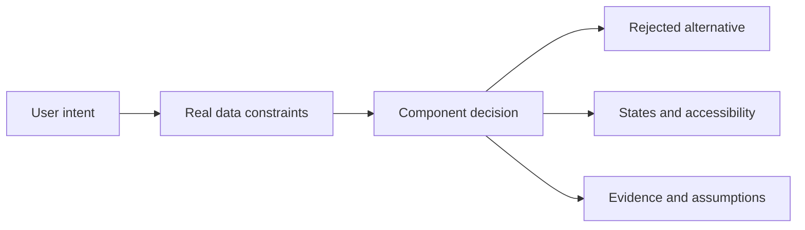

# Choose UI

**Stop guessing UI components. Choose them from user intent, constraints, and evidence.**

Choose UI is a Claude skill that decides which interaction pattern fits a product flow, explains why, rejects the closest wrong alternative, and names the states and accessibility behavior the implementation needs.

It starts with a deliberately sharp rule:

> If there is only one available option, do not render a dropdown. Apply the value and present it as readable text.

The useful part is everything around that rule: actions are not selections, navigation is not a segmented control, short comparable choices should not be hidden, and a mobile picker is not merely a smaller desktop dropdown.

## Why this exists

AI can produce polished interfaces while choosing the wrong interaction model. Design systems document good components, but product teams still have to decide which component represents the user's actual task.

Choose UI turns that decision into a repeatable workflow:

1. Classify the intent: input, filter, view switch, action, navigation, or setting.
2. Evaluate option count, growth, comparison need, effect timing, platform, and accessibility.
3. Choose one pattern and state the evidence.
4. Include the real states: loading, empty, error, disabled, focus, selection, and long content.



## Example

Prompt Claude:

```text
Use choose-ui to review this checkout form. The shipping-method dropdown
currently has one available option, and the value is submitted with the order.
```

Expected decision:

```text
Recommendation: static value
Confidence: high
Why: One fixed option creates no meaningful user choice.
Avoid: A disabled or one-item dropdown falsely implies choice.
Required states: loading, resolved, unavailable, long-content
Accessibility: Present the value as readable text and include it in submitted data programmatically.
```

## Install for Claude Code

### Project skill

Copy `.claude/skills/choose-ui` into the same path in your project:

```bash
cp -R .claude/skills/choose-ui /path/to/your-project/.claude/skills/
```

### From the Agent Skills ecosystem

```bash
npx skills add progwon/choose-ui@choose-ui
```

Claude discovers the skill from its name and description. Invoke it explicitly with `choose-ui` when you want a visible decision record.

## Deterministic baseline

The skill includes a zero-dependency Python recommender for structured prompts, CI checks, and bulk audits:

```bash
python3 .claude/skills/choose-ui/scripts/recommend.py \
  --intent input \
  --options 4 \
  --selection single \
  --comparison high \
  --platform mobile
```

JSON output is available for automation:

```bash
python3 .claude/skills/choose-ui/scripts/recommend.py \
  --intent filter \
  --options 14 \
  --selection multiple \
  --search \
  --format json
```

The script is a baseline, not a replacement for product judgment. The skill tells Claude when direct research, content complexity, localization, or an established design system should override a threshold.

## Current coverage

- Static values and empty states
- Buttons and action menus
- Links, tabs, and navigation lists
- Checkboxes, radios, and radio cards
- Segmented controls and selection chips
- Selects and comboboxes
- Mobile sheets and large selection surfaces
- Single and multiple selection
- Accessibility and required UI states
- Audit severity and replacement guidance

## Principles

- Choose behavior before appearance.
- Do not render interaction without agency.
- Keep choices visible when comparison matters.
- Add search only when it reduces retrieval cost.
- Design for credible production data, not fixture data.
- Prefer native semantics before custom widgets.
- Explain overrides instead of pretending thresholds are universal laws.

## Evidence

The framework synthesizes guidance from [SEED](https://seed-design.io/components/radio), [GOV.UK Design System](https://design-system.service.gov.uk/components/select/), [Carbon](https://carbondesignsystem.com/components/dropdown/usage/), [Apple HIG](https://developer.apple.com/design/human-interface-guidelines/pop-up-buttons), [WAI-ARIA APG](https://www.w3.org/WAI/ARIA/apg/), and [WCAG](https://www.w3.org/TR/WCAG22/).

The wording and decision framework are original. Sources are paraphrased and linked rather than copied. See [`sources.md`](.claude/skills/choose-ui/references/sources.md) for provenance notes.

## Evaluate it

Run the public scenario suite:

```bash
python3 -m unittest discover -s tests -v
```

The cases live in [`evals/cases.json`](evals/cases.json). They are intentionally readable so designers and engineers can disagree with a rule, add evidence, and submit a better case.

## Contributing

The best contribution is a concrete product situation where the current recommendation is wrong or underspecified. Include the user intent, constraints, expected pattern, and a primary source or research finding when possible.

Read [`CONTRIBUTING.md`](CONTRIBUTING.md) before opening a pull request. New design-system adapters, platform conventions, evaluation cases, and accessibility corrections are welcome.

## Roadmap

- Selection controls — current
- Actions, confirmation, and undo
- Navigation, tabs, disclosure, and hierarchy
- Forms, validation, and progressive disclosure
- Feedback, loading, empty, and error states
- Framework-specific implementation checks
- Source-code and screenshot audit modes

## License

[MIT](LICENSE)
