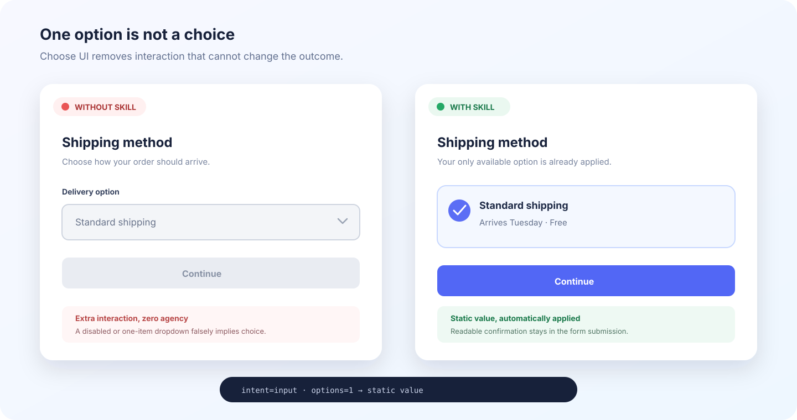
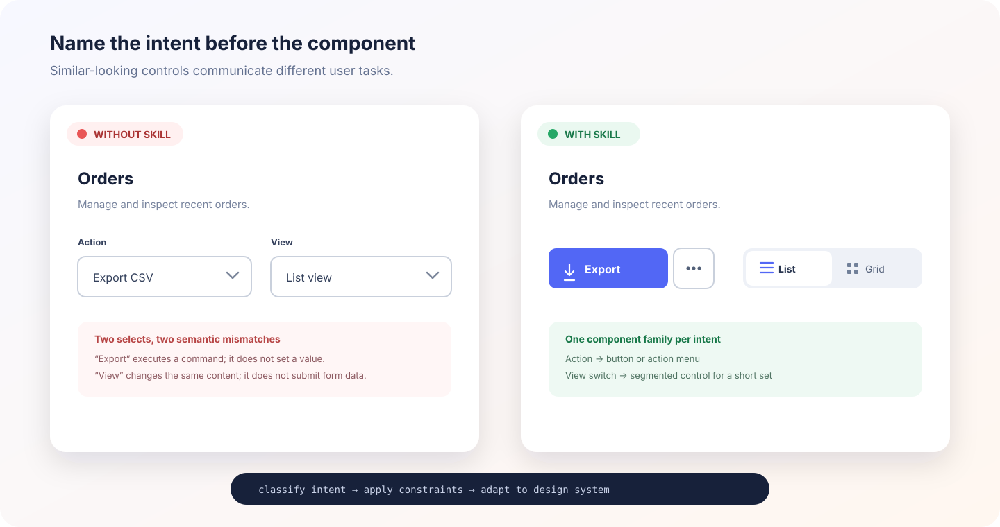
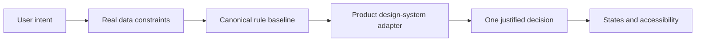

# Choose UI

[](https://github.com/ProgWon/choose-ui/actions/workflows/test.yml)
[](LICENSE)

**Stop guessing UI components. Choose them from user intent, real constraints, and evidence.**

Choose UI is a Claude skill that decides which interaction pattern fits a product flow, explains why, rejects the closest wrong alternative, and names the states and accessibility behavior an implementation needs.



_Illustrative UI mockup—not the output of a live prompt benchmark._

It starts with a deliberately sharp rule:

> If there is only one available option, do not render a dropdown. Apply the value and present it as readable text.

The useful part is everything around that rule: actions are not selections, navigation is not a segmented control, short comparable choices should not be hidden, and a mobile picker is not merely a smaller desktop dropdown.



_Illustrative UI mockup—not the output of a live prompt benchmark._

## Why this exists

AI can produce polished interfaces while choosing the wrong interaction model. Design systems document good components, but product teams still have to decide which component represents the user's actual task.

Choose UI turns that decision into a repeatable workflow:

1. Classify intent: input, filter, view switch, action, navigation, or setting.
2. Evaluate current and credible option count, value kind, comparison need, frequency, effect timing, platform, and accessibility.
3. Inspect the project's component inventory and translate the generic pattern into its real design-system name.
4. Choose one pattern, reject the closest mismatch, and include production states.



## Example

Prompt Claude:

```text
Use choose-ui to review this checkout form. The shipping-method dropdown
currently has one available option, and the value is submitted with the order.
```

For a narrow question, the skill stays brief:

```text
Recommendation: static value
Why: One fixed option creates no meaningful user choice.
```

For implementation, audits, or ambiguous decisions, it returns the full record: confidence, rejected alternative, required states, accessibility, assumptions, and evidence.

## Install for Claude Code

### From the Agent Skills ecosystem

```bash
npx skills add progwon/choose-ui@choose-ui
```

### Project skill

Copy `.claude/skills/choose-ui` into the same path in your project:

```bash
cp -R .claude/skills/choose-ui /path/to/your-project/.claude/skills/
```

Claude discovers the skill from its name and description. Invoke `choose-ui` explicitly when you want a visible decision record.

The optional [`agents/openai.yaml`](.claude/skills/choose-ui/agents/openai.yaml) is bonus metadata for Codex and other Agent Skills clients. Claude ignores it; the Claude skill itself is fully defined by `SKILL.md` and its bundled resources.

## Deterministic baseline

The skill includes a zero-dependency Python rule interpreter for structured prompts, CI checks, and bulk audits:

```bash
python3 .claude/skills/choose-ui/scripts/recommend.py \
  --intent input \
  --options 3 \
  --expected-max-options 9 \
  --selection single \
  --platform mobile
```

Use explicit semantics for a Boolean answer:

```bash
python3 .claude/skills/choose-ui/scripts/recommend.py \
  --intent setting \
  --options 1 \
  --value-kind boolean \
  --effect submit
```

JSON input and `--format json` are available for automation. Other decision flags include `--frequency`, `--comparison`, `--search`, `--custom-value`, and `--rich-options`.

The interpreter performs ordered table lookup; it does not attempt to replace product judgment. Claude handles research, content complexity, localization, and justified design-system overrides.

## One source of truth

[`selection-rules.json`](.claude/skills/choose-ui/references/selection-rules.json) is the canonical ordered rulebook. Both the recommender and the human-readable matrix derive from it.

```text
selection-rules.json
├── scripts/rule_engine.py        # generic first-match interpreter
├── references/selection-controls.md  # generated human reference
└── scripts/rules_tool.py         # schema/source/staleness checks
```

After changing a rule, regenerate and verify the matrix:

```bash
python3 .claude/skills/choose-ui/scripts/rules_tool.py --write
python3 .claude/skills/choose-ui/scripts/rules_tool.py --check
```

This prevents the documentation and executable baseline from silently recommending different controls.

## Current coverage

- Empty, loading, and one-option states
- Boolean switches and submitted checkboxes
- Buttons, action menus, links, tabs, navigation lists, and searchable navigation palettes
- Radios, radio cards, checkboxes, and comparison groups
- Segmented controls and selection chips
- Selects, text inputs, editable comboboxes, and tokenized multi-select comboboxes
- Mobile view, radio, and checkbox sheets
- Credible option growth rather than fixture-only cardinality
- Existing design-system inventory and SEED component mapping
- Accessibility and required UI states
- Quick answers and full audit records

## Principles

- Choose behavior before appearance.
- Do not render interaction without agency.
- Keep choices visible when comparison matters.
- Add search only when it reduces retrieval cost.
- Design for credible production data, not fixture data.
- Prefer existing product components and native semantics.
- Explain overrides instead of pretending thresholds are universal laws.

## Evidence

The framework synthesizes guidance from [SEED](https://seed-design.io/components/radio), [GOV.UK Design System](https://design-system.service.gov.uk/components/select/), [Carbon](https://carbondesignsystem.com/components/dropdown/usage/), [Apple HIG](https://developer.apple.com/design/human-interface-guidelines/pop-up-buttons), [WAI-ARIA APG](https://www.w3.org/WAI/ARIA/apg/), and [WCAG](https://www.w3.org/TR/WCAG22/).

The wording and decision framework are original. Sources are paraphrased and linked rather than copied. See [`sources.md`](.claude/skills/choose-ui/references/sources.md) for provenance notes.

## Evaluate it

Run the public regression suite:

```bash
python3 -m unittest discover -s tests -v
```

[`evals/cases.json`](evals/cases.json) covers deterministic boundary decisions. [`evals/skill-cases.json`](evals/skill-cases.json) covers skill activation, non-activation, output discipline, ambiguous judgment, and design-system adaptation in fresh Claude sessions.

Run the six trigger cases against authenticated Claude Code. Every prompt gets a fresh, non-persistent session, and activation is measured from the actual `Skill` tool call:

```bash
python3 evals/run_skill_evals.py --suite trigger
```

Run behavior and output-shape cases as well, or repeat cases to estimate a less noisy rate:

```bash
python3 evals/run_skill_evals.py --suite all --repeats 3 --model sonnet
```

Automatic scoring is language-tolerant for Korean and English field labels and component terms. Judgment items under `semantic_checks` are printed for human or model-judge review rather than treated as brittle substring assertions. Live model evaluations are intentionally not part of CI because they require Claude authentication, spend budget, and can vary between runs.

## Contributing

The best contribution is a concrete product situation where the current recommendation is wrong or underspecified. Include user intent, constraints, expected pattern, and a primary source or research finding when possible.

Read [`CONTRIBUTING.md`](CONTRIBUTING.md) before opening a pull request. New design-system adapters, platform conventions, evaluation cases, and accessibility corrections are welcome.

## Roadmap

- Selection controls — current
- Actions, confirmation, and undo
- Navigation, tabs, disclosure, and hierarchy
- Forms, validation, and progressive disclosure
- Feedback, loading, empty, and error states
- Framework-specific implementation checks
- Source-code and screenshot audit modes

## License

[MIT](LICENSE)
